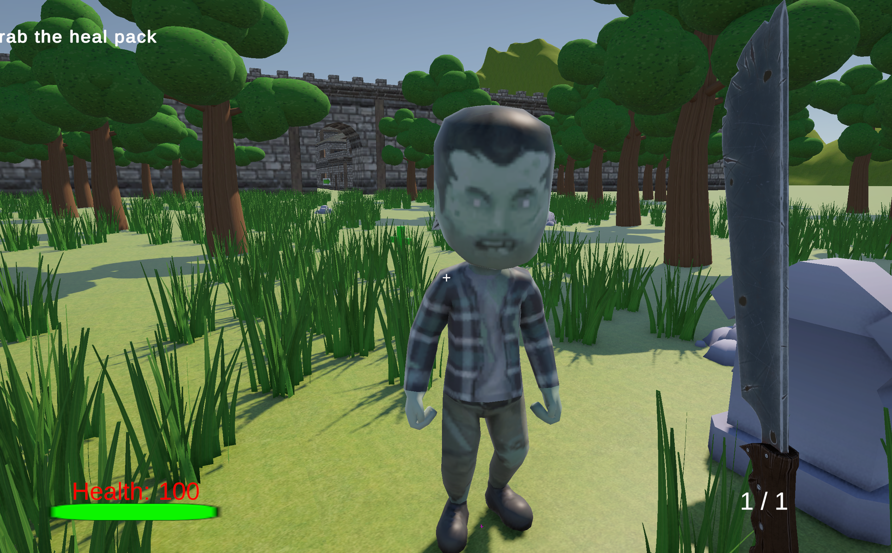
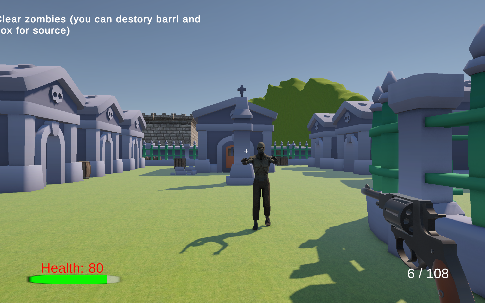
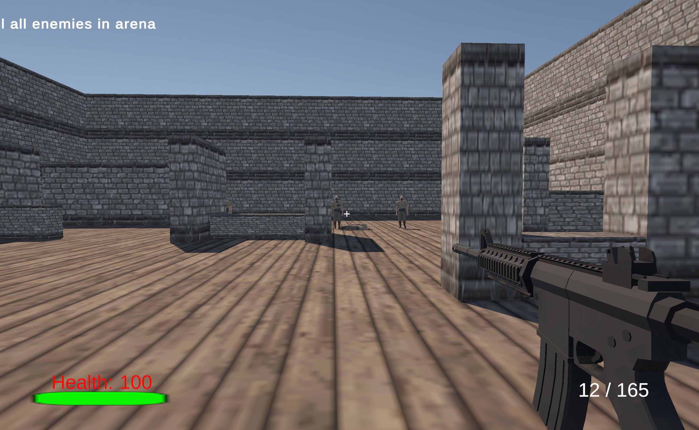

# Unity FPS Game

A single-player first-person shooter prototype developed with **Unity** and **C#** as part of my MSc Computer Science Game Development coursework.

This repository is intended as a **portfolio showcase**. The full Unity source project and third-party assets are not publicly distributed.



## Overview

The project presents a complete playable FPS flow, progressing from an introductory area through exploration and combat encounters to a final boss battle.

The main focus was to build and integrate multiple gameplay systems into a coherent playable level rather than implement isolated mechanics.

## Core Features

- First-person movement and dash
- Weapon switching
- Shooting and reloading
- Health and ammunition pickups
- Key-item collection and level progression
- Dialogue and interaction triggers
- FSM-based quest and story progression
- NavMesh-based enemy navigation
- Animator-driven enemy behaviour
- Enemy wave encounters
- Teleport / progression events
- Final boss encounter
- Complete playable level flow

## Gameplay Flow

```text
Tutorial / Intro
      ↓
Exploration
      ↓
Weapon & Key Item Acquisition
      ↓
Enemy Encounters
      ↓
Wave Combat
      ↓
Final Boss Battle
```

## Gameplay Screenshots

### Enemy Encounter

A close-range enemy encounter demonstrating combat, player health and enemy navigation.



### Graveyard Combat

A ranged combat section featuring a different weapon and environment.


### Wave Combat Arena

A later combat encounter in which the player faces multiple enemies in an arena-style environment.



## Design Focus

### Gameplay Systems

The project combines movement, weapons, pickups, interactions and combat into a connected gameplay loop.

### Quest & Progression

A finite-state-machine approach is used to manage dialogue triggers, quest stages, scene interactions and progression conditions.

### Enemy Behaviour

Enemies use Unity NavMesh navigation together with Animator states to support pursuit, movement and basic combat behaviour.

### Level Flow

The level gradually introduces gameplay mechanics before combining them in later encounters. The difficulty and encounter complexity increase as the player progresses toward the final boss battle.

## Technologies

- **Unity**
- **C#**
- **NavMesh / NavMeshAgent**
- **Finite State Machines (FSM)**
- **Animator**

## My Contribution

My work on the project included:

- Gameplay system implementation
- Player movement and combat mechanics
- Weapon switching, shooting and reloading
- Pickup and health systems
- Quest and dialogue progression logic
- Enemy navigation and basic AI behaviour
- Enemy wave and boss encounter flow
- Level progression and gameplay testing

## Playable Build

A playable Windows build is available through the **Releases** section of this repository.

[Download the latest Windows demo](../../releases/tag/v1.0-demo)

After downloading:

1. Extract the archive.
2. Keep the executable together with its accompanying `_Data` folder and Unity runtime files.
3. Run the included `.exe` file.

## Portfolio Note

This repository is provided for recruitment and portfolio demonstration purposes.

The original Unity project, source files and redistributable third-party asset packages are not included.

---

**Qicong Xie**  
MSc Computer Science · University of Nottingham
